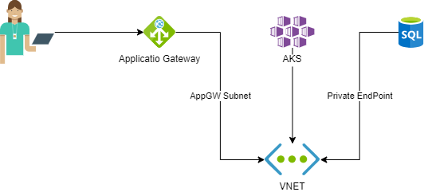

# AKS architecture patterns

One of the design patterns used in production system:

* Communication to cluster terminated on Azure Application Gateway (SSL offload, routing)
* Certificate issued by ACME bot in Aure Function (for AppGateway or for Frontdoor)
* communication in cluster routed by NGINX ingress controller with private IP
* communication with database services routed via VNET to Private EndPoints

https://docs.microsoft.com/en-us/azure/architecture/reference-architectures/microservices/aks



### preprare ingress with internal IP

```bash
# nginx with internal IP

# create namespace
kubectl create namespace nginx-ingress-internal

# update helm repos
helm repo add ingress-nginx https://kubernetes.github.io/ingress-nginx
helm repo update 

# install ingress
helm install nginx-ingress-internal ingress-nginx/ingress-nginx -f ingress.yaml --namespace nginx-ingress-internal

# collect internal IP of NGINX service
kubectl get svc -n nginx-ingress-internal
```

### use ACME bot for creating certificate

https://github.com/cloudfieldcz/azure-acmebot


### deploy AppGW

Deploy Application Gateway to VNET which is connected to AKS.

Also we will need Managed Identity with access rights to KeyVault with SSL certificates for server.

```bash
# assign identity to AppGW
az network application-gateway identity assign -g AATEST --gateway-name appgw --identity cf-dev-appgw

# enable soft delete on keyvault
az keyvault update --name cf-dev-acme-ce57 --resource-group DEV-NETWORK-SHARED \
    --enable-purge-protection true --enable-soft-delete true

# assign identity to keyvault
    az keyvault set-policy -n cf-dev-acme-ce57 --secret-permission get --object-id "$(az identity show -n cf-dev-appgw -g AATEST --query "principalId" -o tsv)"
```

#### configure AppGW rules to access internal IP of nginx ingress

Configure rules for route traffic from external users to internal IP address of nginx ingress controller.